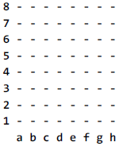
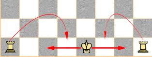
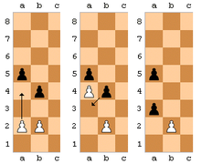
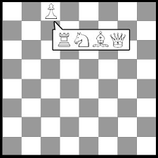
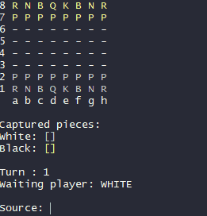

 💻 Atualizado em 17 de Novembro de 2021 💻

<h1 align="center"> :chess_pawn: Chess Game :chess_pawn: </h1>

  

  

  

[Projeto](#id1)&nbsp;&nbsp;&nbsp;|&nbsp;&nbsp;&nbsp;
[O Jogo](#id2)&nbsp;&nbsp;&nbsp;|&nbsp;&nbsp;&nbsp; 
[Movimentos Especiais](#id3)&nbsp;&nbsp;&nbsp;|&nbsp;&nbsp;&nbsp;
[Demonstração](#id4)

## <a id="id1"> 💻 Projeto </a>

Este projeto foi desenvolvido com base no curso *__Java COMPLETO Programação Orientada a Objetos__* do professor [Nélio Alves](https://github.com/acenelio). Esta aplicação consiste em um jogo de Xadrez, que pode ser executado através do terminal. O jogo possui tratamento de erros, programação defensiva, jogadas especiais do xadrez e previsão de movimento das peças.

## <a id="id2"> :joystick: O Jogo </a>

Peças: Pawn (Peão), Knight (Cavalo), Rook (Torre), Bishop (Bispo), Queen (Rainha) e King (Rei).
|-|

A mecânica do jogo é baseada em linhas (1, 2, 3, 4, 5, 6, 7, 8) e colunas (a, b, c, d, e, f, g, h)

 
 
- Para **escolher** a peça desejada, é necessário selecionar _primeiro_ a **coluna** e logo em seguida selecionar a **linha**, exemplo: **d2**
- **Captured pieces:** Armazena as peças capturadas.
- **Turn:** Exibe o turno atual do jogo.
- **Waiting player:** Exibe qual é o jogador a jogar a próxima peça.
- **Source:** Peça no qual o jogador irá jogar.
- **Target:** Local no qual o jogador irá mover a peça.

## <a id="id3">Movimentos Especiais</a>

<strong>ROQUE</strong>

O Roque é uma jogada especial que envolve a movimentação de duas peças em um único lance, o rei e uma das torres. O objetivo da jogada é proteger o rei, tirando-o do centro.

<strong>EN PASSANT</strong>

En passant é um movimento especial de captura do Peão no jogo de xadrez. Na ocasião do avanço por duas casas do peão, caso haja um peão adversário na coluna adjacente na quarta fileira para as brancas, ou quinta para as pretas, este pode capturar o peão como se "de passagem", movendo-o para a casa por onde o peão capturado passou sobre.

<strong>PROMOÇÃO</strong>

Promoção é uma regra do xadrez que descreve a transformação de um peão que alcança a oitava fileira em uma peça da escolha do jogador como a dama, torre, bispo ou cavalo. A nova peça substitui o peão na mesma casa que concluiu o movimento.
  

  

## <a id="id4"> 🖼️ Demonstração </a>

 